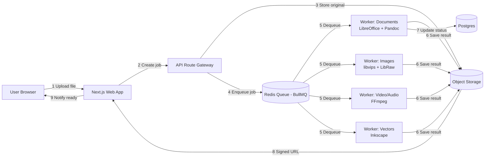

# Universal File Converter — Project Plan

A CloudConvert-style web app for converting documents, images, video, audio, spreadsheets, slides, and vectors — built with Next.js, aiming for a premium, non-templated feel.

---

## 1. Product Summary

**What it is:** a browser-based tool where a user drags in a file, picks a target format, and gets back a converted file — across ~180 formats spanning 7 categories.

**The honest framing:** there's no single engine that converts "anything to anything." What actually exists is a handful of specialist engines, each owning one category, orchestrated behind one unified UI. The product's value is in that orchestration, the UX, and reliability at scale — not in a magic universal converter.

**Core categories in scope:**

| Category | Formats (examples) | Count |
|---|---|---|
| Documents | pdf, docx, doc, odt, rtf, txt, md, tex, html, hwp, pages, wpd... | ~23 |
| Images (raster + RAW) | png, jpg, webp, heic, tiff, psd, cr2, nef, arw, dng... | ~40 |
| Video | mp4, mov, mkv, webm, avi, wmv, mts, vob... | ~28 |
| Audio | mp3, wav, flac, aac, m4a, opus, wma... | ~21 |
| Spreadsheets | xlsx, xls, csv, ods, numbers... | ~8 |
| Slides | pptx, ppt, odp, key, pot... | ~11 |
| Vectors | svg, ai, cdr, eps, wmf, emf, vsd... | ~10 |

---

## 2. Recommended Tech Stack

Your instinct to use **Next.js is right for the frontend and API gateway** — good SEO for per-format landing pages ("HEIC to JPG converter"), App Router, easy API routes, fast to build a premium UI in. Keep it. The part that actually determines whether this project works is the **conversion backend**, which cannot live inside Next.js itself.

### Why Next.js can't do the heavy lifting alone
Conversion engines (LibreOffice, FFmpeg, Inkscape) are native binaries that run for seconds-to-minutes, need real CPU/memory, and don't fit serverless function limits (timeout, no persistent filesystem, no binary installs) or the Edge runtime. So the architecture splits into two apps:

- **`apps/web`** — Next.js. UI, upload handling, job creation, status polling, downloads.
- **`apps/worker`** — a long-running Node.js or Python service (containerized) that actually runs the conversions.

This is the same shape CloudConvert, Zamzar, and every serious converter uses internally — a thin web layer plus a fleet of conversion workers.

### Stack table

| Layer | Choice | Why |
|---|---|---|
| Frontend framework | **Next.js 15 (App Router)** + TypeScript | SEO, fast DX, good fit for per-format pages |
| Styling | **Tailwind CSS**, custom design tokens (not default shadcn look) | Speed without looking templated — see §4 |
| Animation | **Framer Motion**, used sparingly | Upload states, progress, one signature moment |
| API layer | Next.js Route Handlers, acting as a thin gateway | Auth, validation, job creation only — no conversion logic here |
| Job queue | **BullMQ + Redis** | Mature, simple retry/backoff, concurrency control per worker type |
| Worker service | **Node.js (or Python) in Docker**, one image per engine family | Isolates crashes; scale each family independently |
| Object storage | **Cloudflare R2** or **AWS S3** | Cheap egress (R2), signed URLs, lifecycle auto-delete |
| Database | **Postgres** via Prisma | Job metadata, history, optional accounts |
| Auth (optional) | **Auth.js** or **Clerk** | Only needed if you gate usage / add accounts |
| Malware scan | **ClamAV** container in the upload path | Don't skip this — you're accepting arbitrary uploads from strangers |
| Monitoring | **Sentry** + structured logs | Conversion failures need visibility, not silent drops |
| Hosting | **Vercel** (web) + **Fly.io / Railway / a small VPS cluster** (workers) | Vercel is wrong for the workers — no native binary support |

**Alternative frameworks, honestly assessed:** SvelteKit or Remix would work about equally well for the frontend — this is not a Next.js-shaped problem, it's a job-queue-shaped problem. Stick with Next.js since you already want it; the framework choice matters far less here than the worker architecture.

---

## 3. Conversion Engines by Category

This is the part that actually needs to work. Don't write custom parsers — orchestrate these:

| Category | Primary engine | Notes |
|---|---|---|
| Documents, Spreadsheets, Slides | **LibreOffice (headless)** | `soffice --headless --convert-to` handles docx/odt/xlsx/pptx/pdf/rtf and most office formats in one binary |
| Markup/text (md, tex, html, rst) | **Pandoc** | Better fidelity than LibreOffice for pure text/markup round-trips |
| Raster images | **libvips** (via `sharp` in Node) | Much faster and lower-memory than ImageMagick for common formats |
| RAW camera formats (cr2, nef, arw, dng, raf, rw2...) | **LibRaw / dcraw** | Needs periodic updates as camera models release new RAW variants |
| HEIC/HEIF | **libheif** | Patent licensing note: confirm your jurisdiction's HEVC licensing before shipping encode support at scale |
| Vectors (svg, eps, wmf, emf) | **Inkscape CLI** | Solid; CDR (CorelDRAW) support is partial — flag as best-effort |
| Video | **FFmpeg** | Also handles audio extraction from video |
| Audio | **FFmpeg** | Covers essentially the whole audio list |
| PDF-specific ops (merge, forms, OCR) | **pikepdf / PyMuPDF + Tesseract** | Separate from format conversion — needed if you go beyond simple convert-to-pdf |

### Known hard cases — set expectations early
- **Apple iWork (Pages, Numbers, Key)**: no official cross-platform library; Apple doesn't publish the format spec. Realistic options are limited and lower-fidelity. Consider marking these "best effort" or deprioritizing for v1.
- **HWP/HWPX (Hangul Word Processor)**: works through LibreOffice's HWP filter, but fidelity is inconsistent — test heavily before promising it.
- **CDR (CorelDRAW)**: proprietary, partial support only.
- **DJVU**: needs `djvulibre`, a separate dependency from everything else.
- **SWF (Flash)**: source format is effectively dead; treat as legacy input-only, not a conversion target.

Better to launch with 90% of formats working excellently than 100% working inconsistently — the hard cases above are where competitors' complaints usually cluster.

---

## 4. Architecture



### Flow in words
1. User drops a file in the browser; client-side JS detects the source format.
2. Web app requests a signed upload URL, uploads directly to object storage (skip routing large files through your own server).
3. A job row is created in Postgres, pushed to the queue tagged by category (`documents`, `images`, `video`, ...).
4. The right worker pool picks it up, runs the engine, writes the result back to storage.
5. Web app polls (or uses a websocket/SSE) for job status; on completion, hands the user a signed, time-limited download URL.
6. A scheduled cleanup job deletes both source and result files after a fixed TTL (e.g., 1–24 hours) — this matters for cost and for user trust.

### Suggested repo layout (monorepo)
```
/apps
  /web          → Next.js app
  /worker       → conversion service (Docker)
/packages
  /shared       → shared types, job schema, format registry
/infra          → Docker Compose / Terraform for Redis, Postgres, workers
```

---

## 5. UI/UX Direction

The brief is right to worry about this looking "AI-slop." The templated defaults to actively avoid: warm cream background with a terracotta accent, or a near-black background with one neon accent, or a broadsheet layout with hairline rules and zero border-radius — all three show up constantly in AI-generated design regardless of subject matter, so leaning on any of them by default reads as generic even if each is fine on its own.

### Ground the design in the actual subject: transformation
The signature idea for a converter isn't a big stat or a hero illustration — it's the **act of one thing becoming another**. Build the design language around that:
- A **format-to-format transition** as the hero moment: the file's icon/badge morphing from source to target format when a user picks their conversion — this is content-native, not decorative.
- Treat file-format badges (the little "PDF", "MP4", "PNG" tags) as a real typographic/color system of their own — consistent monospace tag style, one accent color family per category (documents vs. media vs. vectors), rather than every format sharing one generic blue button.

### Concrete direction to consider
- **Palette**: pick something specific to "precision tooling," not lifestyle-brand pastel. E.g., a near-white or graphite-dark neutral base, with category-coded accents (not one single brand color for everything) — documents in one hue family, media in another. Name 4–6 exact hex values before building, don't leave it to whatever the component library defaults to.
- **Typography**: a technical/geometric sans for UI (e.g., something in the Inter/Söhne/General Sans family) paired with a monospace face for format codes, file sizes, and progress states — the monospace becomes a recognizable "this is data" signal throughout the product.
- **Layout**: the upload zone is the whole page on first load — don't bury it under a marketing hero. Category and format picker can be a searchable grid of format badges (fast, scannable) rather than a plain dropdown, since there are ~180 options and a dropdown is a bad UX at that scale.
- **Motion**: reserve real animation for one moment — the conversion progress / transformation state — and keep everything else (hover states, page transitions) quiet and fast. Over-animating every element is itself a tell.
- **Copy voice**: plain and functional. "Converting HEIC to JPG…" not "Transforming your masterpiece…". Errors should say exactly what failed and what to do ("This DOCX has a corrupted image and couldn't convert — try re-saving it in Word first"), not a generic "Something went wrong."
- **Dark mode**: worth doing properly given the audience (technical/prosumer users), not just an inverted palette.

Before committing, sketch the token system (palette, type pairing, layout concept, one signature element) and sanity-check it against "would this look right for literally any other SaaS tool" — if yes, revise.

---

## 6. Security, Trust & Compliance

- **Auto-delete everything.** Source and converted files should expire (1–24h is typical). State this clearly in the UI — it's a trust signal, not just infra hygiene.
- **Malware scanning** on upload (ClamAV or a hosted scanning API) before a file ever reaches a conversion worker.
- **Size and rate limits** for anonymous users; higher limits behind an account or paid plan.
- **Sandboxing**: run each conversion in an isolated container/process — LibreOffice and FFmpeg both have had CVEs around malformed input files; never run these directly on a shared host process.
- **No permanent storage of content** unless a user explicitly opts into an account with saved history.
- If you operate in the EU/UK, treat this as a GDPR data-processing question even for temporary storage — have a clear retention policy documented.

---

## 7. MVP Scope (Phase 1)

Don't launch all 180 formats at once. A strong v1:

- **Documents**: pdf ⇄ docx, docx → txt/md, md/html → pdf
- **Images**: png/jpg/webp/heic/gif ⇄ each other, plus 3–4 common RAW formats
- **Audio**: mp3/wav/flac/aac/m4a ⇄ each other
- **Video**: mp4/mov/webm/avi/mkv ⇄ each other
- **Spreadsheets**: xlsx/csv/ods
- **Slides**: pptx/odp/pdf

That alone covers the overwhelming majority of real-world requests and lets you validate the queue/worker architecture before adding long-tail formats (HWP, Pages, CDR, DJVU, RAW variants) in Phase 2.

---

## 8. Build vs. Buy Note

Self-hosting every engine (this plan) gives you full control, no per-conversion fees, and a defensible product — but real infrastructure work (worker scaling, storage, format edge cases). A faster-to-market alternative is **CloudConvert's own API** (white-labelable) or Zamzar's API as the conversion backend behind your custom Next.js frontend — you get the premium UI you want to build without owning the engine fleet, at the cost of per-conversion pricing and less control over the hard cases. Worth prototyping the UI against a hosted API first, then deciding whether to bring conversion in-house once you have real usage data.

---

## 9. Open Questions to Resolve Before Building

- Anonymous usage vs. required accounts — affects rate limiting and monetization from day one.
- Free tier limits (file size, conversions/day) vs. paid tier.
- Self-hosted engines vs. hosted API for v1 (see §8) — recommend starting hosted, migrating to self-hosted once usage justifies the ops burden.
- Which long-tail formats (Pages, HWP, CDR) are worth the fidelity risk vs. explicitly marked "unsupported" in v1.
