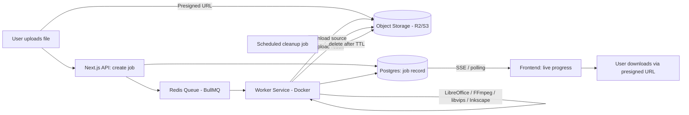

# Universal File Converter — Project Plan

A CloudConvert-style web app for converting documents, images, video, audio, spreadsheets, slides, and vectors — built with a premium, non-templated UI.

---

## 1. Scope Reality Check

CloudConvert supports ~200+ formats because it's had a decade of engineering behind it. Trying to ship all seven categories (documents, images, video, audio, spreadsheets, slides, vectors) on day one is the single biggest risk to this project. The plan below is built around a **phased rollout** so you get a working, polished product fast instead of a half-finished converter for everything.

**Recommended MVP (Phase 1):** Documents + Spreadsheets + Slides + common raster Images. These are all handled by two engines (LibreOffice + Sharp/libvips), so the backend stays simple while you nail the UI.

**Later phases:** Vectors → Audio → Video → RAW camera formats → exotic legacy formats (`.wpd`, `.lwp`, `.sdw`, `.hwp`, etc.), which are the long tail and rarely requested.

---

## 2. Tech Stack

### Frontend
| Layer | Choice | Why |
|---|---|---|
| Framework | **Next.js 14+ (App Router)** | Good fit — SSR for SEO on landing/format pages, API routes for light backend logic, huge ecosystem |
| Language | TypeScript | Non-negotiable at this scope |
| Styling | Tailwind CSS + **shadcn/ui** (Radix primitives) | Gives you accessible, unstyled-by-default components you fully re-skin — avoids the generic "AI SaaS" look |
| Animation | Framer Motion | For drag-drop states, progress transitions, micro-interactions |
| State/data | TanStack Query (React Query) | Polling/refetching job status cleanly |

### Backend — this is the part Next.js alone can't handle well
Document/video/audio conversion needs real CPU time, real binaries (LibreOffice, FFmpeg), and sometimes minutes of processing. **Vercel serverless functions are the wrong place to run this** — they have execution time limits (10s–60s typically, up to 900s on paid tiers) and restrictive deployment sizes that don't play well with LibreOffice or FFmpeg binaries.

**Recommended split architecture:**
- **Next.js** — frontend, auth, job creation API, status polling. Deploy on Vercel.
- **Worker service** — a separate Node.js (or Python) service running in Docker, doing the actual conversion. Deploy on Railway, Render, Fly.io, or a plain VPS (Hetzner/DigitalOcean) since these support long-running containers with full OS access.

| Component | Choice |
|---|---|
| Job queue | BullMQ + Redis (self-hosted or Upstash) |
| Worker runtime | Node.js or Python, containerized |
| Database | PostgreSQL (via Prisma) — job metadata, not files |
| File storage | S3-compatible object storage — **Cloudflare R2** is a good pick (no egress fees, cheap) |
| Uploads | Direct-to-storage via presigned URLs (don't proxy big files through your Next.js server) |
| Real-time status | Server-Sent Events (SSE) or polling every 1–2s — SSE is simpler than WebSockets for one-directional "job progress" updates |
| Auth (if adding accounts) | Auth.js (NextAuth) or Clerk |

### Conversion engines by category
| Category | Engine | Notes |
|---|---|---|
| Documents (docx, odt, rtf, pdf, txt, etc.) | **LibreOffice headless** | `soffice --headless --convert-to` covers most of your document list in one tool |
| Markdown / TeX / HTML | **Pandoc** | Better fidelity than LibreOffice for markup formats |
| Spreadsheets & Slides | **LibreOffice headless** | Same engine as documents |
| Raster images (png, jpg, webp, tiff, bmp, etc.) | **libvips** (via `sharp` in Node) | Much faster and lighter than ImageMagick at scale |
| Camera RAW (cr2, nef, arw, dng, raf, etc.) | **LibRaw / dcraw** | Separate from your main image pipeline — RAW is its own can of worms |
| Vectors (svg, eps, wmf, emf) | **Inkscape CLI** | Good open coverage; `.ai`/`.cdr` support is partial (see risks below) |
| Video | **FFmpeg** | Handles virtually everything on your video list |
| Audio | **FFmpeg** | Same binary as video |

### Alternative stacks worth considering
- **SvelteKit instead of Next.js** — if you want less boilerplate and a snappier bundle; slightly smaller ecosystem for admin/dashboard UI kits.
- **Remix** — similar tradeoffs to Next.js, marginally better for progressive-enhancement-heavy forms (relevant for uploads), smaller community.
- **Full Python backend (FastAPI) instead of Node worker** — if you're more comfortable in Python, FastAPI + Celery is a very mature equivalent to Node + BullMQ, and Python has slightly better bindings for some conversion libs (e.g., `pypandoc`, `python-libreoffice` wrappers).

**Bottom line:** Next.js for the frontend is a solid, defensible choice. The real architectural decision isn't Next.js vs. something else — it's making sure conversion work happens in a separate, long-running worker service instead of trying to cram it into serverless functions.

---

## 3. Architecture



**Flow in words:**
1. User drags a file in → uploaded directly to object storage (presigned URL, skips your server).
2. Frontend creates a "job" (source format, target format, file reference) via a Next.js API route.
3. Job is pushed to a Redis queue.
4. A separate worker container picks it up, downloads the file, runs the right conversion engine, uploads the result.
5. Job status updates in Postgres; frontend gets live updates via SSE or short polling.
6. User downloads the converted file from a time-limited presigned URL.
7. A scheduled cleanup job deletes files after ~24 hours — important for both storage cost and privacy.

---

## 4. UI/UX — Making It Not Look "AI-Coded"

The generic AI-SaaS look (purple-to-blue gradient hero, glassmorphism cards, Inter font, floating blob shapes) is exactly what to avoid. A few concrete ways to look premium and intentional instead:

- **One distinctive typeface pairing**, not a default. A confident display/serif or a well-chosen grotesque for headings, paired with a clean sans for body text. Avoid Inter-for-everything.
- **A restrained palette** — pick 2–3 real brand colors plus neutrals, not a default indigo/violet gradient. Commit to a specific mood (e.g., warm neutral + one accent, or high-contrast mono + one accent).
- **Custom format icons**, not generic file-icon SVGs. A consistent icon set per format (PDF, DOCX, MP4, etc.) does more for perceived quality than almost anything else on this kind of tool.
- **A real drag-and-drop zone** with satisfying states: idle, hover, dragging-over, uploading (real progress, not a fake spinner), success, error. This is the single most-used surface on the site — it deserves the most design attention.
- **Searchable, grouped format picker** instead of a giant alphabetical dropdown — group by category (Documents, Images, Video...) with icons, and let people type to filter.
- **Subtle motion, not decorative motion** — Framer Motion for state transitions (upload → converting → done) rather than gratuitous parallax or floating shapes.
- **Trust signals stated plainly**: max file size, auto-delete policy ("files deleted after 24 hours"), no dark patterns around ads or fake "scanning for viruses..." delays.
- **Dark mode** as a first-class citizen, not an afterthought toggle.

Good reference points for restraint and confidence in design language: Linear, Raycast, Vercel's own marketing site. None of them lean on gradients or stock illustration — they lean on typography, spacing, and precise motion.

*(When you're ready to actually build the UI, there's a frontend-design skill I can pull in that covers concrete design-token and styling guidance for this — just ask when you get there.)*

---

## 5. Key Technical Risks

- **Apple iWork formats** (`.pages`, `.key`, `.numbers`) — poorly documented, proprietary, and no open-source tool converts them reliably. Expect to either skip these initially or accept low fidelity.
- **CorelDraw (`.cdr`)** — same story; only partial support via Inkscape, often breaks on newer file versions.
- **RAW camera formats** — need LibRaw specifically; don't assume your general image pipeline (sharp/libvips) handles these.
- **Video/audio codec licensing** — some codecs bundled with FFmpeg builds (e.g., certain AC3/AAC encoders) carry patent licensing considerations for commercial use in some jurisdictions. Worth a legal check before monetizing video conversion specifically.
- **Malicious uploads** — this is an open file-upload service by design. Validate file types server-side (not just by extension), consider ClamAV scanning, and sandbox the worker containers.
- **Abuse/cost control** — video conversion is CPU-expensive; without rate limits or file-size caps, a few large uploads can spike your compute bill. Build in per-IP or per-account limits from day one.

---

## 6. Suggested Repo Structure

```
file-converter/
├── apps/
│   ├── web/                 # Next.js app (frontend + light API routes)
│   │   ├── app/
│   │   ├── components/
│   │   └── lib/
│   └── worker/               # Conversion worker service (Docker)
│       ├── src/
│       │   ├── converters/
│       │   │   ├── documents.ts   # LibreOffice wrapper
│       │   │   ├── images.ts      # sharp/libvips wrapper
│       │   │   ├── vectors.ts     # Inkscape wrapper
│       │   │   ├── video.ts       # FFmpeg wrapper
│       │   │   └── audio.ts       # FFmpeg wrapper
│       │   ├── queue.ts
│       │   └── index.ts
│       └── Dockerfile
├── packages/
│   └── shared/                # Shared types (job schema, format enums)
└── docker-compose.yml         # Local dev: Redis + Postgres + worker
```

Monorepo (Turborepo or plain npm workspaces) keeps the shared job-type definitions consistent between the Next.js app and the worker.

---

## 7. Phased Roadmap

| Phase | Scope | Engines needed |
|---|---|---|
| 1 (MVP) | Documents, Spreadsheets, Slides, common Images | LibreOffice, sharp |
| 2 | Vectors, Markdown/TeX/HTML | Inkscape, Pandoc |
| 3 | Audio | FFmpeg |
| 4 | Video | FFmpeg (heavier infra — queue autoscaling matters here) |
| 5 | RAW images, legacy/exotic formats | LibRaw, best-effort long tail |

---

## 8. Optional: Monetization Notes
- Free tier: daily conversion cap + max file size (e.g., 100MB).
- Paid tier: larger files, batch conversion, priority queue placement.
- This only matters once Phase 1–2 prove there's real usage — not a day-one concern.
